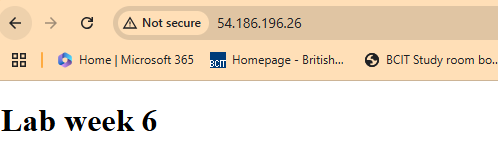

## Web Server Screenshot

Here is the screenshot showing the deployed web server:



##  Project Summary: Automating AMI Creation & EC2 Deployment with Packer & Terraform

###  Overview
This project automates the **creation of a custom AWS AMI using Packer** and **deploys an EC2 instance using Terraform**. The AMI includes **Nginx**, serves an HTML file, and is configured for web hosting.

---

##  Steps We Completed

### 1️⃣ Cloned the Starter Code
We started by cloning the repository:
```bash
git clone https://gitlab.com/cit_4640/4640-w6-lab-start-w25.git
cd 4640-w6-lab-start-w25
```

---

### 2️⃣ Installed Packer & AWS CLI
- Installed **Packer** to automate the AMI creation.
- Configured **AWS CLI** using:
  ```bash
  aws configure
  ```
- Verified installation:
  ```bash
  packer --version
  aws --version
  ```

---

### 3️⃣ Configured `web-front.pkr.hcl` for Packer
- Used **Ubuntu 24.04** as the base AMI.
- Installed **Nginx** and configured it to serve `index.html`.
- Used **provisioners** to:
  - Upload files (`index.html`, `nginx.conf`).
  - Configure permissions (`www-data` for Nginx).
  - Restart the Nginx service.

 **Final AMI ID Created:** `ami-0f3404d11462607b7`

---

### 4️⃣ Built the AMI Using Packer
```bash
packer init .
packer build web-front.pkr.hcl
```
 **Successfully created a custom AMI with Nginx installed and ready to serve web pages.**

---

### 5️⃣ Deployed EC2 Instance Using Terraform
- Created a `main.tf` file to **launch an EC2 instance** from our custom AMI.
- Configured:
  - **VPC:** `vpc-03778c277464eb4e4`
  - **Subnet:** `subnet-0ce22d3c73db4df58`
  - **Security Group:** Allowed SSH (your IP only) & HTTP (open to all).
- Applied the Terraform configuration:
  ```bash
  terraform init
  terraform apply -auto-approve
  ```

 **Instance Launched & Public IP Assigned!**

---

### 6️⃣ Accessed the Web Server
- Retrieved **public IP** from Terraform output:
  ```bash
  terraform output public_ip
  ```
- Opened the website in a browser:
  ```
  http://<PUBLIC_IP>
  ```
 **Web page successfully served from the deployed EC2 instance!** 🎉

---

### 7️⃣ Added Screenshot to README
- Took a screenshot of the webpage.
- Uploaded it to the repository.
- Added this Markdown snippet in `README.md`:
  ```md
  ## Web Server Screenshot

  Here is the screenshot showing the deployed web server:

  
  ```

 **Now, GitHub displays the screenshot in the README.**

---

### 8️⃣ Resolved Git Issues & Pushed Changes
Encountered and fixed:
- **Merge conflicts** (`git pull --rebase`).
- **Push rejected (non-fast-forward)** (`git push --force`).
- **Committed final changes**:
  ```bash
  git add .
  git commit -m "Finalized deployment, added screenshot"
  git push origin main
  ```

 **Project successfully pushed to GitHub!** 

---

##  Key Learnings
- **Packer** for AMI creation.
- **Terraform** for AWS infrastructure provisioning.
- **Nginx Configuration & Automation**.
- **Git & GitHub Collaboration**.
- **AWS CLI & EC2 Management**.


